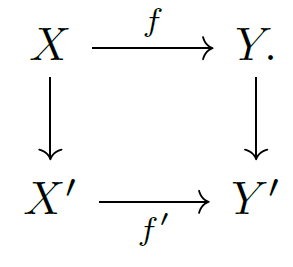

------

------

[TOC]

------

# 范畴论笔记

## 引言

本文为范畴论基础知识的笔记，原书为李文威老师的[《代数学方法-基础架构》](https://github.com/wenweili/AlJabr-1 )

[《代数学方法-基础架构》]: https://github.com/wenweili/AlJabr-1	"“代数学方法-基础架构的LaTeX稿”"

第二章内容，本文将以定义来源推导的方式重构范畴论基础体系。

本文重心不为Grothendieck宇宙，于是将会忽略一些对于 $U$ 范畴的讨论.

图片部分采用李文威老师书内原图，部分为自己做的交换图表.

以下为李文威老师对于范畴学基础的介绍:

概括地说，范畴是由对象以及其间的态射组成的数学结构，从对象  $X$   到对象   $Y$   的态射 $f$ 习惯使用箭头来表述

$$
 X \xrightarrow{f} Y
$$

而函子可以视为范畴间保持箭头结构的某种“映射”，函子之间的关系由自然变换描述。

范畴论的特色在于重视关联甚于数学对象本身*(在可表函子一节会讲述数学对象也可以表述成所有打到其上的态射)* ，并以同构代替严格等式，最明显的例证是代数学中无处不在的泛性质。

## 基础知识

基础知识包含：范畴与态射、函子与自然变换、范畴等价与范畴同构以及函子范畴，为范畴论最基础的部分.

### 范畴与态射

#### 范畴由来

在学习范畴之前应当先对于范畴进行定义，范畴是一种研究结构的结构的数学工具，我们若要研究结构的结构，就需要研究结构的作用对象以及结构的性质。

我们解刨两个“麻雀”来管中窥豹研究结构的结构：

1. 群与集合的区别，我们发现在群没有被代数运算所约束构成代数系统时，其无非就是一个集合，既然要研究结构的结构，就需要从结构内部作用对象之间的关系研究起，群相比起集合，两个群之间的关系为群同态，即映射需要满足同态性质(若 $f$ 为群 $G$ 到 $G'$ 的群同态，则对于$a,b \in G$，我们有$f(a)f(b) = f(ab)$)这种映射保持了群的结构性质，而集合之间的映射可以不遵守这样一个性质，故可以得到一个结论：态射反映了结构的性质.

2. 考虑所有群组成的集合$Grp$和所有Abel群组成的集合$Ab$，显然有$Ab \subset Grp$,而它们内部保持结构的态射均为群同态，所以可以得到第二个结论：对象限制了结构的范围.(或许有更好的词进行描述)

   于是可以得到以下结论:如果我们要研究结构的结构，就需要从对象和态射(保持结构的映射)入手，即通过研究结构内部对象之间的关系(态射)，结构的对象来研究结构。

于是自然可以得到范畴的定义如下：

定义 : 一个范畴$C$系指以下资料

   1. 集合$\text{Ob}(C)$，其元素称为$C$的__对象__(Object).

   2. 集合$\text{Mor}(C)$，其元素称作$C$的__态射__(Morphism),配上一对映射  $\text{Mor}(\mathcal{C}) \xRightarrow[t]{s} \text{Ob}(\mathcal{C}) $(标准写法为$\text{Ob}(C) \xleftarrow{s} \text{Mor}(C) \xrightarrow{t} \text{Ob}(C)$,此处为了简写写成这种格式), 其中 $s$ 和 $t$ 分别给出态射的来源($f \in \text{Mor}(C)$若$f:X\to Y$，则有$s(f) = X$)和目标(从前文可知$t(f)=Y$). 对于 $X, Y \in \text{Ob}(\mathcal{C})$, 一般习惯记$\text{Hom}_{\mathcal{C}}(X, Y) := s^{-1}(X) \cap t^{-1}(Y)$ (即所有由$X$中打出的映射的集合与所有打向$Y$的集合所构成的交集，即所有从$X$打向$Y$的映射所构成的集合)或简记为 $\text{Hom}(X, Y)$, 称为$\text{Hom}$-集, 其元素称为从 $X$ 到 $Y$ 的态射.

   3. 对每个对象$X$给定元素$\text{id}_X \in \text{Hom}_C(X,X)$称为$X$到自身的__恒等(identity)态射__.

      对于任意地$X,Y,Z \in \text{Ob}(C)$ ，给定态射之间的__合成映射__

       $$  \circ : \text{Hom}_C(Y,Z)\times \text{Hom}_C(X,Y) \to \text{Hom}_C (X,Z) \\ (f,g)\mapsto f \circ g $$ 

      不至混淆时常将$f\circ g$简记为$fg$ 。它满足

      * 结合律: 对于给定态射 $h,g,f \in \text{Mor}(C)$若合成的$f(gh)$和$(fg)h$都有定义，则$f(gh)=(fg)h$ 故两边可以同时简写为$f\circ g \circ h$,或$fgh$

      * 对于任意态射$f \in \text{Hom}_C(X,Y)$，有

         $$ f\circ \text{id}_X = f = \text{id}_Y\circ f $$ 

不难发现，范畴$C$有以下特性：

1. 注意到$\text{id}_X$被其性质所唯一确定.对象集和态射集合皆为空集的范畴称为__空范畴__，记为__0__.

2. 一般也将$f\in \text{Hom}_C(X,Y)$写作$f : X\to Y$或$X \xrightarrow{f} Y$,故态射有时又叫__箭头__.态射的合成对应于箭头的头尾衔接.图表加箭头是讨论范畴的方便语言.其中最常用的是交换图表的概念，“交换”指箭头合成的殊途同归。

   以下是一个交换图表的例子

   

   上图中的交换性等价于$gf = h$.态射的名称(如$f,g$等等)如自明或不重要，常从图表中省去.

3. 对于态射$f:X \to Y$，若存在$g:Y\to X$使得$fg = \text{id}_X$，$gf = \text{id}_Y$，则称$f$是__同构__(或可逆，写作$f :X\xrightarrow{\sim} Y$)，而$g$称为$f$的逆，从恒等态射的性质易知逆若存在则唯一.从$X$到$Y$的同构集记作$Isom_C(X,Y)$.

4. 记$End_C(X): = \text{Hom}_C(X,X)$,$Aut_C := Isom_C(X,X)$,分别称作$X$的自同态集和自同构集.

既然有范畴，我们可以试图类比集合与子集、群与子群、线性空间与子空间等概念得到子范畴的概念，即子范畴的对象集和态射集均为原范畴的子集，并且保持恒等态射，此外来源与目标映射以及态射的合成均由原范畴限制而来。

于是可以得到子范畴的严格定义如下

定义 : 称$C'$是范畴$C$的子范畴，如果

1.  $ \text{Ob}(C')\subset \text{Ob}(C)$;
2.  $ \text{Mor}(C')\subset \text{Mor}(C)$，并保持恒等态射;
3. 来源/目标映射 $\text{Mor}(C') \xRightarrow[t]{s} \text{Ob}(C')$是由$C$限制而来.
4.  $ C'$中态射的合成也是由$C$限制而来.

不难发现，有些子范畴可以全盘继承原范畴在两个对象之间的所有态射(也就是说除了对于对象集限制以外并没有其他的限制)，即$\text{Hom}_{C'}(X,Y) = \text{Hom}_C(X,Y)$，这类范畴我们称为__全子范畴__.

##### 习题1

1. 预序集等同于任意一对对象$(X,Y)$之间至多有一个态射$f:X\to Y$的范畴：对于预序集$(P,\leq)$,定义范畴使其对象集为$P$，而存在态射$p\to p'$当且仅当$p\leq p'$，此时这样的态射唯一.

   试根据有限序数($0:=\varnothing$,$\alpha +1 := \alpha \sqcup  {\alpha}$,$\sqcup$表示无交并)地递归定义得到一个序数$n$为对象集的范畴，并且讨论$0$和$1$地特殊性.

   

   提示：任意$n \in Z_{\geq 0}$可以视为全序集$\{0,\cdots,n-1\}$其结构(忽略恒等态射)可以表为$0\to1\to\cdots\to(n-1)$,对于$0=\varnothing$,即为空范畴$0$，而$1$仅包含$1$个对象以及$1$个态射($\text{id}_1$)($1$给出的范畴将在泛性质以及逗号范畴处得到广泛运用)

   

2. 试给出以所有集合为对象所给出的范畴$\text{Set}$，所有群为对象集所给出的范畴$\text{Grp}$，所有交换群为对象集所给出的范畴$\text{Ab}$，域$\mathbb{k}$上所有线性空间为对象集所给出的范畴$\text{Vect}(\mathbb{k})$,(将以有限维线性空间所给出的范畴记为$\text{Vect}_f(\mathbb{k})$,$f$应代表finite，即有限)

   

3. 是否存在某个范畴，其态射只有恒等态射.

   

   提示：定义离散范畴$\text{Disc}(S)$，使得其对象集为$S$，而任意$x,y \in S,x \neq y$有$\text{Hom}_{\text{Disc}(S)}(x,y) = \varnothing$，并且使$\text{Hom}_C(x,x) =\{\text{id}_x\}$，即我们所需要的范畴。

   

4. 范畴除了对象以外，其态射是否可以类似于映射的单满射一样得到一些共同的性质，比如是否可逆?

   

   提示：欲知后事如何，且听下回分解：__对于范畴的进一步讨论__.

#### 对于范畴的进一步讨论

既定义范畴与子范畴的概念，接下来应当对于范畴的内部进行讨论，对于对象不需要进行特殊划分(因其抛去所有结构后就为一个集合)，对于态射由集合中映射的单满性可以得到态射的单满性：

对于范畴$C$，取$X,Y,Z\in \text{Ob}(C)$，$f \in \text{Hom}_C(X,Y)$

1. 若$f$为映射单射，则对于$a,b\in X$，有：若$a = b$则有$f(a) = f(b)$.

   于是对于$g,h \in \text{Hom}_C(Z,X)$有若$g(z) \neq h(z)$($z \in Z$)，则有$f(g(z)) \neq f(h(z))$,且若$f(g(z)) =f(h(z))$,则必然有$h(z) = g(z)$，于是可以得到 $fg = fh \Leftrightarrow g = h$,若$f$为映射满射不一定可以得到这个结论，并且若$f$不为单射则必然无法得到这个结论

   于是推广到态射上(由于态射都是映射，于是可以进行推广)可以得出:若$f$为单态射，则必有$fg = fh \Leftrightarrow g=h$ ,称满足这种条件为满足__左消去律__.

2. 若$f$为映射满射，则对于$\forall y\in Y$ ，$\exists x\in X$ ，$f(x) = y$

   于是对于$g,h \in \text{Hom}_C(Y,Z)$有若$g(y)\neq h(y)$($y \in Y$)，则有$g(f(x)) \neq h(f(x))$，且若对于所有的$x \in X$均有$g(f(x)) = h(f(x))$，则有$g = h$，于是可以得到$gf = hf \Leftrightarrow g=h$,若$f$为映射单射不一定可以得到这个结论，并且若$f$不为满射必然无法得到这个结论($\exists y \in Y ,\nexists x \in X,f(x) = y$,若有$gf = hf$未必有$g = h$ )

   于是推广到态射上可以得出:若$f$为满态射，则必有$gf = hf \Leftrightarrow g=h$,称满足这种条件为满足__右消去律__。

   如果存在$g $使得$gf = \text{id}_X$，则称$f$左可逆并且称$g$是$f$的一个左逆，并且$f$为一个单态射，此时也称$f$为一个__截面__(或者嵌入);类似地若$fg = \text{id}_Y$则称$f$右可逆并且$g$是一个右逆，并且$f$是一个满态射，此时也称$f$为一个__收缩__。一个态射__可逆__当且仅当其左右__皆可逆__。

通过对于态射集以及群的概念进行讨论，发现若范畴$C$态射集为$G$，$G$为群，$C$只有一个对象$x$，于是有$End(x) = G$，即范畴$C$中所有的态射均可逆。若范畴$C'$只有一个对象$S$，则$End(S)$为一个含幺半群(不一定可逆)，态射的合成规定为含幺半群的代数运算。

于是可以推出以下概念:则若一个范畴$C$中的所有态射均可逆，则称$C$为广群。

##### 习题2

1. 有时候我们需要反向地研究范畴(即在相同的作用范围下具有相反的性质)，我们称反向地范畴为对偶范畴或者反范畴，记为$C^{op}$，试定义$C^{op}$

   

   提示：

   相同的作用范围即作用对象相同，即$\text{Ob}(C^{op}) = \text{Ob}(C)$

   相反的性质即对于态射集有$\text{Hom}_C(X,Y) = \text{Hom}_{C^{op}}(Y,X)$,对于$X,Y \in \text{Ob}(C)$，也可以说是态射被倒转了.

   虽然性质相反，但是对于恒等映射并无影响。

   但是对于映射的合成具有影响，若$f \in \text{Hom}_{C^{op}}(Y,Z) = \text{Hom}_C(Z,Y)$,$g \in \text{Hom}_{C^{op}}(X,Y) = \text{Hom}_C (Y,X)$,在原范畴中的合成$g\circ f \in \text{Hom}_C(Z,X) = \text{Hom}_{C^{op}}(X,Z) = f \circ^{op}g$.

   并且有性质: $(C^{op})^{op} = C$.

   注记：反范畴的运用非常广泛

   

2. 试定义基本广群(拓扑概念，先了解道路合成以及道路的同伦)

   

   提示：自己看书，太麻烦了，懒得抄

   

3. 证明:对于范畴中的态射$f$，下述两两条件等价:

   1.  $ f$为收缩单态射
   2.  $ f$为嵌入满态射
   3.  $ f$为同构

   并且举例说明双态射未必为同构

   

   提示：证明显然，举例:考虑序数$2$范畴，有$f:0 \to 1$,由于只有$2$个元素，并且态射为$\{\text{id}_0,\text{id}_1,f\}$，于是显然有$f$为双态射，但是无法找出$f$的左逆或者右逆

   

4. 试探索范畴之间是否可以具有态射，如果有，又该如何定义?

   

   欲知后事如何，且听下回分解：__函子__

   

###  函子

#### 函子的定义

既然要研究结构的结构，从前文已经得知态射反映了结构的性质，于是对于结构的结构的性质也需要利用态射来进行反映，这就可以推导出__函子__概念，即范畴之间的态射。

那么如何去定义函子这个概念呢？通过对于子范畴以及习题2第1题对于反范畴的定义可以得知，需要对于对象集与态射集分别进行考虑，对于对象集应为对象之间的映射，态射集也应当为态射间的映射(需要注意来源与目标映射，恒等映射)，并且需要保持原结构的性质不变(保持原映射的合成为变换后两个映射的合成)。

于是不难得到以下定义

定义(__函子__) : 设$C'$,$C$为范畴.一个函子$F : C'\to C$意谓以下资料:

1. 对象之间的映射 $F : \text{Ob}(C') \to \text{Ob}(C)$

2. 态射之间的映射$F: \text{Mor}(C') \to \text{Mor}(C)$，需要满足以下条件

   *  $ F$与来源和目标映射相交换(即$sF = Fs$，$tF = Ft$)，等价的说法是对于每个$X,Y \in \text{Ob}(C')$皆有映射$F : \text{Hom}_{C'}(X,Y) \to \text{Hom}_C(FX,FY)$(等价性留作习题，提示：对于$\text{Hom}_C(FX,FY) = s^{-1}(FX)\cap t^{-1}(FY)$以及$\text{Hom}_{C'}(X,Y) = s^{-1}(X)\cap t^{-1}(Y)$进行讨论即可)
   *  $ F(g \circ f) =F(g)\circ F(f)$(保持结构性质不变),$F(\text{id}_X) = \text{id}_{FX}$

   与态射的合成相似，对于$F : C_1 \to C_2$,$G:C_2 \to C_3$,可以定义合成函子$G \circ F : C_1 \to C_3$:取合成映射

   

   常称$F$为从$C'$到$C$的共变函子(也称为协变函子)，而称形如$F:(C')^{op}\to C$的函子为反变函子.

__注记__ : 从$C'$到$C$和从$(C')^{op}$到$C^{op}$的函子是一回事. 为资区分，对于函子$F:C'\to C$，反范畴间的相应函子记为$F^{op}:(C')^{op}\to C^{op}$.

由于态射具有单满性，我们来探讨是否函子也一样具有单满性，但是由于函子同时作用于对象集与态射集，所以需要对于对象集和态射集分别进行考虑，自然也就不止一个单满性，故需要进一步讨论：

对于对象集，由于范畴的作用对象范围往往具有很大的差异，并且一个范畴的对象之间可能存在同构关系(比如群同构)，于是对于范畴对象集的同构类进行讨论更符合我们的诉求(在后文的范畴等价中也会体现)

设$F$为范畴$C'$到$C$的函子

将范畴的对象集中所有的同构类(由于同构关系为等价关系，于是可以对于对象集以同构关系取商集)取代表元所组成的集合称为__本质__。若函子对于本质为满射，即对于$C$中任意一个对象都与某个$FX$同构，$X \in C'$，称满足这种特性的函子为__本质满__(essentially surjective)函子。

对于范畴的态射集进行讨论，由于函子在态射集上的作用为$X,Y \in \text{Ob}(C'), F:\text{Hom}_{C'}(X,Y) \to \text{Hom}_C(FX,FY)$。讨论函子在态射集合上的单满性就需要对于上式进行讨论。

若$F:\text{Hom}_{C'}(X,Y) \to \text{Hom}_C(FX,FY)$为单射(即$\forall f,g \in \text{Hom}_{C'}(X,Y)$，若$Ff = Fg$有$f = g$)，称满足这种特性的函子为__忠实__(faithful)函子，即函子具有忠实性(对于$\text{Hom}$集元素忠实)

若$F:\text{Hom}_{C'}(X,Y) \to \text{Hom}_C(FX,FY)$为满射(即$\forall g \in \text{Hom}_C(FX,FY)$,$\exists f \in \text{Hom}_{C'}(X,Y)$，$Ff = g$)，称满足这种特性的函子为__全__(full)函子(可以完全填满映射后的$\text{Hom}$集)

此外还有一些其他的函子性质

称$F$是一个__嵌入__(embedding),若它在态射层面是单射，即对于任意态射$f,g$有$Ff = Fg$蕴含$f = g$(即对于对象集也为单射)。不难验证嵌入等价于忠实并且对于对象而言是单射(见习题反例)。

接下来研究几个经典的例子:

1. 子范畴$C' \subset C$给出一个包含函子$\iota: C' \hookrightarrow C$，将$X \in \text{Ob}(C')$映射至$X \in \text{Ob}(C)$，对于态射同样如此，显然包含函子为嵌入函子，并且常常忠实而非全，若包含函子为全函子，则需$C'$为一个全子范畴.

2. 由于之前所述任意结构(比如群，环，域)在忽略其代数运算所赋予的结构后均为一个普通的集合，于是根据这个思路可以得到一个__忘却函子__，即遗忘掉部分(或全部)自身结构使其变为另一个相对较弱的结构的函子，对于群范畴$\text{Grp}$中的任意一个群$G$总是可以遗忘$G$的群结构而视其为一个集合$S\in \text{Ob}(\text{Set})$，群同态同样可以视为集合间的映射，不难看出这类函子忠实而非全(集合映射不一定满足群同态)..

3. __对偶函子__:考虑域$\mathbb{k}$上的向量空间范畴$\text{Vect}(\mathbb{k})$.对于任意的$\mathbb{k}$-向量空间$V$，定义其对偶空间
   $$
   V^{\lor } := Hom_{\mathbb{k}}(V,\mathbb{k}) = \{\mathbb{k}-线性映射V \to \mathbb{k}\}
   $$
   任一线性映射$f: V_1 \to V_2$，诱导对偶空间的反向映射
   $$
   f^{\lor} : V_2^{\lor} \to V_1^{\lor}\\
   [\lambda : V_2 \to \mathbb{k}] \mapsto \lambda \circ f
   $$
   显然有$D: V \mapsto V^{\lor}$,$f \mapsto f^{\lor}$定义了函子$D: \text{Vect}(\mathbb{k})^{op} \to \text{Vect}(\mathbb{k})$，可以验证是忠实的(习题).根据[注记](#注记)可知，我们有合成函子$DD^{op}:\text{Vect}(\mathbb{k}) \to \text{Vect}(\mathbb{k})$，将$D$限制于有限维向量空间即可得到函子$D: \text{Vect}_f(\mathbb{k})^{op} \to \text{Vect}_f(\mathbb{k})$和$DD^{op}:\text{Vect}_f(\mathbb{k}) \to \text{Vect}_f(\mathbb{k})$，分别称为对偶和双对偶函子.

##### 习题3

1. 验证对于每个$X,Y \in \text{Ob}(C')$皆有映射$F : \text{Hom}_{C'}(X,Y) \to \text{Hom}_C(FX,FY)$等价于$sF = Fs$，$tF = Ft$，其中$F: C'\to C$

   

   提示：[前文](#习题3.1提示)已经给出

   

2. 验证[对偶函子](#对偶函子)是忠实函子

   

   提示：$D : V \mapsto V^{\lor} , f\mapsto f^{\lor}$中对于$f,g \in \text{Hom}_{\text{Vect}(\mathbb{k})}(V_1,V_2)$,若$Df = Dg$，则有$[\lambda : V_2 \to \mathbb{k}] \mapsto \lambda \circ f = [\lambda : V_2 \to \mathbb{k}]$ $\mapsto \lambda \circ g$，即$f = g$.即在$\text{Hom}$集上$D$为单射，即$D$为忠实函子.

   

3. 对于群$G$，定义导出子群$G_{der}$为子集$\{xyx^{-1}y^{-1} : x,y \in G\}$生成的正规子群.

   1. 验证商群$G/G_{der}$为Abel 群，称作$G$的Abel化.
   2. 对于任意群同态$\psi : G \to H$，从定义可以看出$\psi(G_{der}) \subset H_{der}$，因此$\psi$诱导出Abel群的同态$\overline{\psi} : G/G_{der} \to H/H_{der}$.容易验证$G \mapsto G/G_{der}$，$\psi \mapsto \overline{\psi}$定义了Abel化函子$\text{Grp} \to \text{Ab}$.验证Abel化函子不是忠实函子

   

   提示：$G$到$H$和$H/H_{der}$的群同态在Abel化后相等.

   

4. 函子之间是否能够相互转化?如果能相互转化，该如何进行?

   

   提示：欲知后事如何，且听下回分解：__自然变换与函子的同构__.

#### 自然变换与函子的同构

不难发现函子也具有一定的结构性质(反映范畴的结构)，于是可以研究来源和目标相同的函子与函子之间的关系，这两个函子之间可以相互转换，由于函子的表达依赖于态射集与对象集，并且态射是连接对象的方法，于是不难得出如果需要建立函子之间的转换方式，需要从对象和两个对象间的态射入手，对于$F,G:C' \to C, X \in \text{Ob}(C)$，从$F$到$G$的转换即为$f \in \text{Hom}_C(FX,GX)$，让$X$遍历$C'$的全体对象则可以得到函子之间态射的定义.

定义(__自然变换__,函子间的态射) : 函子$F,G : C' \to C$之间的自然变换$\theta$是一族态射
$$
\theta_X \in Hom_C(FX,GX) ,X \in Ob(C')
$$
使得下图对所有$C'$中的态射$f:X \to Y$交换

上述自然变换写作$\theta : F\to G$或者图解为

上述带有双箭头$\Rightarrow $的图表有时候也称为2-胞腔，一种兴许有益的看法是设想$\theta$为从$F$到$G$的一个同伦($\theta = \theta(\cdot,t) $;$ \theta(\cdot,0) = F(\cdot),\theta(\cdot,1) = G(\cdot)$).

约定 : 我们也将自然变换$\theta:F\to G$称为从函子$F$到$G$的态射.实用中经常会省略严格的范畴论框架，只说态射$\theta_X:FX \to GX$是典范的，自然的，或称其满足函子性.实践中经常把自然同构写成等号$=$.

考虑范畴中态射的合成，易得自然变换为函子之间的态射同样可以进行合成，具体合成方式分为横纵两个方面。

* 纵合成：考虑$C'$到$C$的三个函子间的态射$\theta:F\to G$，$\psi : G \to H$.纵合成即为纵向合成，纵合成$\psi \circ \theta$定义为$\{\psi_X\circ \theta_X : X\in \text{Ob}(C') \}$，图解：

  合成为

* 考虑函子及态射$\theta : F_1 \to F_2$,$\psi : G_1 \to G_2$.今将定义横合成$\psi \circ \theta : G_1 \circ F_1 \to G_2\circ F_2$.首先注意到对所有的$X\in \text{Ob}(C'')$，根据$\psi$的自然性，图表

  

  交换.对角合成$\searrow $记作$(\psi \circ \theta)_X:G_1F_1(X) \to G_2F_2(X)$，此即所求的横合成.图解

  合成为

  

* 横合成还有下述特例.请端详

  

  先看左三项: 我们将以 $\theta H : FH \to GH$简记横合成$\theta \circ \text{id}_H$;具体地说，$(\theta H)_X = \theta_{HX}: FH(X) \to GH(X)$；类似地对于右三项:记$K\theta :KF \to KG$为横合成$\text{id}_K \circ \theta$，我们有$(K\theta_X) : KF(X) \to KG(X)$.

  我们用同一个符号$\circ$来表示纵横合成.

  至目前为止我们只讲述了纵横合成的定义，但是并没有说明自然变换在经过纵横合成之后是否还是自然变换以及其是否服从结合律，接下来我们验证纵横合成后仍为自然变换并且服从结合律:

  横合成：

  * 定义合理性

    沿用之前的符号，对于$C''$中的态射$f:X\to Y$，考虑源于之前的交换图表

    

    依照定义可知，水平方向按照箭头合成后上下分别是$(\psi \circ \theta)_X$和$(\psi \circ \theta)_Y$.因为$\theta$是自然变换而$G_1$是函子，左方块交换；由于$\psi$是自然变换，右方块交换.将箭头分段作合成，可知整个大方块交换，此即$\psi \circ \theta$所需性质.

    

  * 结合律

    考虑函子间的态射

    

    对于$\forall X\in \text{Ob}(C'')$，考虑图表

    

    施$\psi$的自然性于$G_2F_1(X) \to G_2F_2(X)$可知菱形部分交换.按照上半部分的合成给出$(\phi \circ (\psi \circ \theta))_X$按照下半部分合成给出$((\phi\circ\psi)\circ \theta)_X$；由于图表交换，可知横合成满足结合律.

  纵合成:

  * 定义合理性

    沿用之前的符号，对于

    

    依照定义可知，水平方向按照箭头合成后上下分别是$(\psi\circ\theta)_X$和$(\psi \circ \theta)_Y$,因$\theta$是自然变换而$F,G$是函子，于是左方块交换，同理，右方块交换，于是有态射的定义合理.

  * 结合律

    考虑函子间的态射

    

    对于$\forall X \in \text{Ob}(C')$考虑图表

    

    由于图表交换可知$(\theta_1 \circ(\theta_2 \circ \theta_3))_X = ((\theta_1 \circ \theta_2) \circ \theta_3)_X$.即纵合成满足结合律

    同理易证对于图表

    

    以下的互换律成立
    $$
    (\psi' \underset{\text{纵}}{\circ} \theta')\underset{\text{横}}{\circ}(\psi \underset{\text{纵}}{\circ} \theta)=(\psi' \underset{\text{横}}{\circ} \psi)\underset{\text{纵}}{\circ}(\theta' \underset{\text{横}}{\circ} \theta)
    $$
    以上的证明留作习题.

    

在自然变换中我们将函子视为对象，于是自然可以定义函子到自身的恒等态射.

对于$F: C' \to C$定义其恒等态射如下$\text{id}_F : F\to F$.

即有$\text{id}_F$的概念，自然可以以态射的可逆性对于自然变换这个函子之间的态射进行推广.从而得到逆的概念，若对于一个自然变换$\theta : F_1 \to F_2$，若其可逆，依据[态射可逆的定义](#态射可逆的定义)自然就存在一个自然变换$\psi :F_2 \to F_1$使得$\psi \circ \theta = \text{id}_{F_1}$同时有$\theta \circ \psi = \text{id}_{F_2}$.由于$\text{id}_{F_1}$与$\text{id}_{F_2}$具有唯一性，故一个自然变换__若可逆必然唯一__,于是可以将其记为$\theta^{-1}$，它可以被理解为在范畴$C'$的对象集中逐点地取逆:$(\theta^{-1})_X := (\theta_X)^{-1}:F_2X \xrightarrow{\sim}F_1X$.同理可证自然变换$\theta$可逆当且仅当每个$\theta_X$均可逆.

我们称这样的$\theta$为函子之间的同构(类似于群同构为一个使两个群同构的态射一样).

函子间同构$\theta:F_1 \xrightarrow{\sim} F_2$的等价说法是称$\theta_X:F_1X \xrightarrow{\sim}F_2X$对于变元$X$是__自然同构__或__典范同构__.

##### 习题4

1. 证明前文所述的[互换律](#习题4.1).

   

   提示：仿照证明纵横合成结合律的交换图表即可.

   

2. 证明:自然变换$\theta$可逆当且仅当每个$\theta_X$均可逆.

   

   提示：由前文立即得到.

   

3. 证明:函子间同构$\theta:F_1 \to F_2$的等价说法是称$\theta_X:F_1X \xrightarrow{\sim}F_2X$对于变元$X$是__自然同构__或__典范同构__.

   

   提示：由2可以直接推出.

   

4. 试探索范畴之间是否也可以得到一个同构和等价关系.

   

   提示：欲知后事如何，且听下回分解： __范畴之间的同构与等价__.

   

5. 试探索两个范畴间的函子是否能给出一个全新的范畴

   

   提示：欲知后事如何，且听下下回分解：__函子范畴__.

#### 范畴之间的等价与同构

根据函子之间同构以及同构的概念，由于函子是范畴之间的态射，于是可以推广出范畴同构的概念:

若函子$F:C_1 \to C_2$为范畴之间的同构，则存在函子$G : C_2 \to C_1$使得对于任意的$X_1,X_2 \in \text{Ob}(C_1) , Y_1,Y_2 \in \text{Ob}(C_2)$有:$GFX_i = X_i$,$FGY_i =Y_i$($i \in\{1,2\}$，对于态射集自然有$\text{Hom}_{C_1}(GFX_1,GFX_2) =\text{Hom}_{C_1}(X_1,X_2)$，让$X_i,Y_i$遍历所有对象集的元素，则有$FG = \text{id}_{C_2}$且$GF =\text{id}_{C_1}$.称$G$是$F$的逆.

那么范畴同构到函子上会是如何表达的呢？

由于$F,G$为函子$\text{id}_{C_i},i \in \{1,2\}$也为函子，于是不难得到这两组函子均严格相等($FG$ 与 $\text{id}_{C_2}$严格相等并且$GF$与$\text{id}_{C_1}$严格相等，而不仅仅只是同构.但是正如引言所述，在范畴中一般[以同构来代替严格等式](#以同构代替严格等式)，于是需要探究当这两组函子均以同构的形式存在时的情况.当两组函子同构时，有$\psi : GF \xrightarrow{\sim} \text{id}_{C_1}$并且存在$\theta : FG \xrightarrow{\sim} \text{id}_{C_2}$，这个时候$G$不能称为是$F$的逆，只能称为是$F$的拟逆(函子间的同构下放到范畴层次为等价，自然就不是同构的逆了)，称$G$为$F$的拟逆函子.$F$称为$C_1$到$C_2$的范畴等价.

由于$\text{id}_{C_i}$具有唯一性，函子的逆只有一个，但是拟逆可以有多个，接下来先对拟逆进行讨论：

设$G,G'$均为$F: C_1 \to C_2$的拟逆，接下来我们研究拟逆之间的关系，有$G'FG = (G'F)G =G'(FG)$，再由$\psi ' : G'F \xrightarrow{\sim} \text{id}_{C_1}$，$\theta : FG \xrightarrow{\sim} \text{id}_{C_2}$，于是可以得到$G' \xleftarrow[\sim]{\psi' \circ \text{id}_G} (G'F)G = G'(FG)   \xrightarrow[\sim]{\text{id}_{G'}   \circ \theta} G$,进行合成(__同构的合成还是同构__)得到$G \xrightarrow{\sim} G'$.发现拟逆函子之间相差一个同构，即拟逆函子在相差一个同构的情况下是唯一的(泛性质).

接下来我们对范畴的等价进行讨论：

设$C_1$和$C_2$为两个范畴，$F:C_1 \xrightarrow{\sim} C_2$为范畴等价，取其拟逆$G:C_2 \xrightarrow{\sim}C_1$和自然变换$GF \xrightarrow[\sim]{\psi} \text{id}_{C_1}$，$FG \xrightarrow[\sim]{\phi} \text{id}_{C_2}$.

1. 对象集上

   对于$C_2$中任意对象$Z$有$\phi_Z: F(GZ) \xrightarrow{\sim} Z$于是对于$F$有$F$本质满，对于$C_1$中的任意对象$K$有$\psi_K : G(FK) \xrightarrow{\sim} K$得到$G$也本质满，于是不难得出一个结论：范畴的等价必为本质满函子.

2. 但是范畴的等价不止为本质满这一条性质，接下来对于态射集中对象之间的态射进行讨论：

   对于对象$X,Y \in \text{Ob}(C_1)$，$f \in \text{Hom}_{C_1}(X,Y)$，有

   

   $\psi_Y GF(f)\psi_X^{-1}$合成为恒等映射，于是有$GF \xrightarrow{\sim} \text{id}_{C_1}$，即$F$左可逆，$G$右可逆.调换$G,F$角色，取$X',Y' \in \text{Ob}(C_2)$有

   

   $\phi_{Y'}FGf'\phi^{-1}_{X'}$合成为恒等态射，于是有$FG \xrightarrow{\sim} \text{id}_{C_2}$，即$F$右可逆，$G$左可逆.(注记：$(\phi_Y)_*$以及$(\phi^{-1}_X)^*$为态射$\phi_Y$做推出与对态射$\phi^{-1}_X$做拉回，拉回和推出是我们对于两个对象间的态射集进行转化时的利器，在__函子范畴__中我们会对拉回与推出进行定义，见函子范畴的[\text{Hom}函子](#\text{Hom}函子).)

   于是$F$与$G$均可逆，即$F$与$G$均为全忠实函子.

自此我们得到范畴等价均为全忠实，本质满函子.

由于范畴等价为本质满函子，于是对于本质类而言__范畴等价必为满射__，于是不妨在每一个本质类中取一个代表元进行研究，于是可以得到范畴$C$的一个子范畴$C'$使$C$中每个对象$X$都存在同构$X \xrightarrow{\sim} Y \in \text{Ob}(C')$，而且此$Y\in \text{Ob}(C')$是唯一的.由于范畴等价为全忠实函子，于是对子范畴$C'$取为全子范畴更符合我们的需要.称这一类范畴为骨架.

不难发现，对于任意范畴都有一副骨架(尚未证明)，有些范畴自身就是骨架，这类范畴称为骨架范畴.

接下来对于骨架和骨架范畴上的范畴等价进行讨论.

1. 先证明任何范畴$C$都有一副骨架$C'$

   使用选择公理在$\text{Ob}(C)$的每个同构类中选取一个代表元，由这些代表元构成的全子范畴记作$C'$.

   即任何范畴都有一副骨架

   >  选择公理：ZFC公理体系中的一条公理，其内容为:设集合$X$的每个元素皆非空，则存在函数$g:X \to \bigcup X$使得$\forall x\in X ,g(x) \in x$. 另外集合论中我们认为任何元素都为集合 ，一般将$X$视为一族非空的集合，选择函数$g(x)\in x$即意味着从每个集合$x\in X$中挑出一个元素，在本次证明中$X$可以视为前文所述的[本质类构成的商集](#本质类))

2. 其包含函子是等价

   于是由选择公理可以在$\text{Hom}_C(X,\kappa{X})$中选出[同构](#同构的态射)$\theta_X:X\xrightarrow{\sim}\kappa(X)$.其中$\kappa(X) \in \text{Ob}(C')$，不妨假设对于每个$X\in \text{Ob}(C')$都有$\theta_X =\text{id}_X$(也可以视为一种规定)，则存在__唯一一种__方法使得$\kappa : \text{Ob}(C) \to \text{Ob}(C')$延拓为函子并使得$\theta : \text{id}_C \xrightarrow{\sim} \iota \kappa$：置
   $$
   \kappa f : = \theta_Y \circ f \circ \theta^{-1}_X \in Hom_{C'}(\kappa(X),\kappa(Y))， f\in Hom_C(X,Y)
   $$
   另一方面，由于$\kappa \iota = \text{id}_{C'}$，因此由范畴等价的定义知包含函子是等价，而$\kappa$是$\iota$的拟逆函子.

3. 接下来观察骨架范畴间的等价

   设$C_1$，$C_2$为骨架范畴，$F:C_1 \xrightarrow{\sim} C_2$是范畴间的等价.

   由[前文](#范畴等价是全忠实，本质满函子)可知$F$是全忠实，本质满函子.对任意$C_2$中的对象$Z$都有$FX \simeq Z ,X \in \text{Ob}(C_1)$，由[骨架范畴](#骨架范畴)的定义可知$Z = FX$，这样的$X$也是唯一的，于是有$FX \simeq FX'$蕴含$X \simeq X'$，于是$F$在对象集上为双射，即在对象集上$F$可以找到一个逆$G$使得$GF = \text{id}_{C_1}$并且$FG = \text{id}_{C_2}$.即$F$为范畴间的同构.

得到以下结论：

引理：任意范畴$C$总有一副骨架$C'$且包含函子$\iota : C' \hookrightarrow  C$是范畴等价.骨架范畴间的范畴等价(只需要全忠实本质满即可)是同构.

接下来由骨架范畴与原范畴之间的关系可知对于[前文](#范畴等价的性质)中的$C_1$和$C_2$分别取骨架范畴$C_1'$和$C_2'$，取包含函子$\iota_i : C_i' \hookrightarrow C_i$及其拟逆函子$\kappa_i$,$i \in\{1,2\}$.

函子$F’:=\kappa_2 \circ F \circ \iota_1 : C_1' \to C_2'$仍为全忠实，本质满函子，由[引理](#骨架范畴引理)可以得到$F'$为$C_1'$到$C_2'$的同构.于是可以对其取逆得到$F'^{-1}:C_2' \to C_1'$，再将$F'^{-1}$转移为原范畴间的函子，构造$G := \iota_1 \circ F'^{-1} \circ \kappa_2$.则有

使用自然变换的横合成可以得知$F$为范畴之间的等价.

于是得到以下定理：

定理：对于函子$F:C_1 \to C_2$，以下叙述等价:

1.  $ F$是范畴等价
2.  $ F$是全忠实本质满函子

##### 习题5

1. 考虑某域$\mathbb{k}$上的向量空间范畴$\text{Vect}(\mathbb{k})$及其子范畴$\text{Vect}_f(\mathbb{k})$.[前文](#双对偶函子)已经定义了双对偶函子.对于任意向量空间$V$都有求值映射
   $$
   \text{ev} : V \to DD^{op}V = (V^{\lor}) ^{\lor}\\ v\mapsto [\lambda \mapsto \lambda(v)]
   $$
   试证明：$\text{ev}:V \hookrightarrow DD^{op}V$并且在得知以下结论($\text{ev}$为双射当且仅当有限维的情况下)证明$D: \text{Vect}_f(\mathbb{k})^{op} \to \text{Vect}_f(\mathbb{k})$是范畴间的等价，$D^{op}$是它的拟逆.

   

   提示：

   对于任意线性映射$f : V \to W$从$f^{\lor}$的定义不难得到

   

   交换，即证明$\text{ev}: \text{id} \mapsto DD^{op}$为单射.

   第二步使用双射的性质并结合定理即可证明

   

2. 选定域$\mathbb{k}$，定义范畴$\text{Mat}$如下：其对象是$Z_{\geq 0}$，任意对象$n,m \in Z_{\geq 0}$，定义$\text{Hom}(n,m) : = M_{m \times n}(\mathbb{k})$为域$\mathbb{k}$上的全体$m \times n$矩阵$A = (a_{ij})_{1\leq i \leq m , 1\leq j \leq n }$缩成集合，约定$M_{0 \times n}(\mathbb{k}) = M_{m \times 0}(\mathbb{k})  :=\{0\}$.态射的合成定义为
   $$
   Hom(n,m) \times Hom(m,k) \to Hom(n,k)\\
   (A,B) \mapsto BA
   $$
   定义函子$F:\text{Mat} \to \text{Vect}_f(\mathbb{k})$如下：置$F(n) = \mathbb{k}^{\bigoplus{n}}:=M_{n \times 1}(\mathbb{k})$，而对于$A \in \text{Hom}(n,m)$，线性映射$FA:\mathbb{k}^{\bigoplus{n}}  \to \mathbb{k}^{\bigoplus{m}}$是矩阵乘法$v \mapsto Av$，试证明$F$是范畴等价.

   

   提示：留意到$F:\text{Hom}(n,m) \to \text{Hom}_{\mathbb{k}}(\mathbb{k}^{\bigotimes{n}},\mathbb{k}^{\bigotimes{m}})$，证明其为双射，再由$V \simeq \mathbb{k}^{\bigoplus{dim V}}$可知$F$全忠实本质满.

   > 这一切只是虚张声势的线性代数

   

3. 设$A \xrightarrow{f} B \xrightarrow{g} C \xrightarrow{h} D$是任意范畴中的态射.证明若$A \xrightarrow{gf} C$与$B\xrightarrow{hg} D$皆为同构，则$f,g,h$均为同构

   

   提示：利用范畴同构的定义以及函子的左右逆确定$f,g,h$均为双射，进而证明$f,g,h$皆为同构.

   

4. 同构具有重要意义，那么在一个范畴中，是否可以定义一些特殊的对象(考虑对象之间的态射),使其在最多相差一个同构的意义下是唯一的，如果有，我们该如何去定义这些对象.

   

   提示：欲知后事如何，请听下章分解：__泛性质__.

   

5. 范畴等价为$FG \xrightarrow{\sim} \text{id}_{C_2}$并且$GF \xrightarrow{\sim} \text{id}_{C_1}$，那么是否可以对其进行拓展延伸，只看$GF \to \text{id}_{C_1}$的部分，对于具有这种自然变换(余单位)以及其反向变换(单位)进行讨论，是否能够构造出一个函子同构 $\phi : \text{Hom}_{C_2}(F(\cdot),\cdot) \xrightarrow{\sim} \text{Hom}_{C_1}(\cdot , G(\cdot))$.

   

   提示：欲知后事如何，请听下下下章分解：__伴随函子__.

### 函子范畴

在自然变换中，我们将函子视为变换的对象，并且对于自然变换的纵合成有纵合成后自然变换仍为自然变换，即纵合成后的自然变换仍为函子间的态射.于是对于范畴$C_1$和范畴$C_2$，可以对两个范畴间的全部函子进行讨论，任两个函子$F,G : C_1 \to C_2$，其间的态射为自然变换$\theta : F \to G$，由自然变换的纵合成定义其态射合成.接下来我们验证这样的定义是否可以构成一个范畴.

定义一个范畴$\text{Fct}(C_1,C_2)$，其对象集$\text{Ob}(\text{Fct}(C_1,C_2))$为从$C_1$到$C_2$的所有函子，于是自然可以推出函子之间的关系为自然变换，即函子之间的态射.

对于$\text{Hom}_{\text{Fct}(C_1,C_2)}(F,G)$可知其包含所有对于$C_1$中的任意对象$X$，形如$\theta_X  \in \text{Hom}_{C_2}(FX,GX)$的自然变换.于是由于自然变换的纵合成仍为自然变换，可以定义态射之间的合成为纵合成，即对于$F,G,H \in \text{Ob}(\text{Fct}(C_1,C_2))$有$\phi \in \text{Hom}(F,G) ,\psi \in \text{Hom}(G,H)$，于是$\psi \circ \phi:F \to H $，注意到$(\psi \circ \phi)_X \in \text{Hom}(FX,HX)$，即$\psi_X$可以诱导$\text{Hom}(FX,GX) \to \text{Hom}(FX,HX)$，其方式为对于$\phi_X \in \text{Hom}(FX,GX)$，$\phi_X \mapsto \psi_X\circ\phi_X$，即对于态射进行__"推出"__，同理对于$\theta_X : \text{Hom}(KX,FX)$可以诱导出$\text{Hom}(FX,GX) \to \text{Hom}(KX,FX)$，其方式为$\phi_X \mapsto \phi_X \circ \theta_X$，即对于态射进行__"拉回"__.

于是如果需要验证态射之间的纵合成作为态射的合成是合理的，就需要验证"拉回"与"推出"是合理的.

可以发现拉回与推出都是对$\text{Hom}$集上的操作，于是如果能够定义一个范畴$C$中由对象集到$\text{Hom}$集(由于$\text{Hom}$集本质上就是一个集合，这无非是一个从范畴$C$到集合范畴$\text{Set}$的函子).它将$X ,Y \in \text{Ob}(C)$，$(X,Y)\mapsto \text{Hom}_C(X,Y)$，不难推广出其态射集上对于两个对象之间的态射集$\text{Hom}((X,Y),(X',Y'))$变为$\text{Hom}_{\text{Set}}(\text{Hom}(X,Y),\text{Hom}(X',Y')$(见下文注记，此处是为了解释$\text{Hom} :C ^{op} \times C \to \text{Set}$)，即其形式为$C^{op} \times C \to \text{Set}$.可知这是一个类似于二元运算的__"二元函子"__，需要先定义"二元函子"具有合理性，观察二元运算$A \times B \to C$，有$a \in A,b \in B ,c \in C$，二元运算使$(a,b)\mapsto c$，而左边的笛卡尔积本质上也为一个集合，二元运算本质上也为一个映射.于是定义"二元函子"具备合理性就需要证明二元函子本质上是两个范畴间的函子，即$C_1 \times C_2$为一个范畴，若$C_1,C_2$为范畴.

> 注记: 由于这个函子将$C$中的两个对象所组成的笛卡尔积变为$C$中这两个对象之间的态射集合，那为什么会写成$C^{op} \times C \to \text{Set}$的形式呢？结合我们先前所述的态射的拉回与推出，对于$\text{Hom}(X,Y)$有$f:X' \to X$将态射进行拉回，$g:Y \to Y'$将态射进行推出，于是将$\text{Hom} (X,Y)$变为$\text{Hom}(X',Y')$需要$(f,g) \in \text{Hom}((X,Y),(X',Y')) = \text{Hom}(X,X')\times \text{Hom}(Y,Y')$，不难发现$f \in \text{Hom}(X,X')$而$f \in \text{Hom}_C(X',X)$于是笛卡尔积左侧的范畴应当为反范畴.

仿照笛卡尔积的定义可以得到范畴之间的积的定义，同理仿照余积的定义可以得到范畴之间的余积定义.

> 笛卡尔积:
>
> 对于一族集合$\{X_i:i\in I\}$及其指标集$I$，可以定义一个新集合使其元素为映射$\{f:I\to \bigcup_{i\in I}X_i :f(i) \in X_i \}$.不难发现这个新集合中每一个元素都有$f(i) \in X_i$，即(当$I =\{1,2,\cdots,n\}$时)每个元素都可以写成$(x_1,x_2,\cdots,x_n),x_i \in X_i , i\in I$.即这个新集合可以写成$X_1 \times X_2 \times \cdots \times X_n$,于是当$I$为无穷集合时可以写成$\prod_{i\in I}X_i$.
>
> 于是在本次证明中，先对于范畴的对象集进行考虑，这无非是一族集合组成的笛卡尔积.
>
> 再由对象集推广至态射集，对于两族对象$\{X_i:i \in I\}$和$\{Y_i:i \in I\}$间的所有态射(以$(X_i,Y_i)$为一对进行考虑)，依照$i$的顺序进行定义即可得到范畴的积中两个对象间的态射集为$\text{Hom}_{\prod_{i\in I}C_i}((X_i)_i,(Y_i)_i):=  \prod_{i\in I}\text{Hom}_{C_i}(X_i,Y_i)$.其中$(X_i)_i := \prod_{i\in I}X_i$，由于下面定义为书上定义，不便进行修改，便在注记中进行解释.
>
> 余积: 
>
> 余积在极限中会进行详细讨论，在目前章节只是由范畴的积顺带推出其定义.
>
> 余积其实就是无交并，在范畴中先对于对象集进行无交并处理得到余积范畴的对象集.
>
> 由于为无交并，于是不属于同一个原范畴的两个对象之间并没有交集，即$\text{Hom}$集为空.

定义：设$I$为一个集合(指标集)，而$\{C_i: i \in I\}$为一族范畴.

1. 积范畴$\prod_{i \in I}{C_i}$定义如下：
   $$
   Ob(\prod_{i\in I}{C_i}) &:=& \prod_{i\in I}Ob(C_i)\\
   Hom_{\prod_{i\in I}C_i}((X_i)_i,(Y_i)_i)&:=&  \prod_{i\in I}Hom_{C_i}(X_i,Y_i)
   $$
   我们以$(X_i)_i$来表示$\prod_{i \in I}{C_i}$中的元素，态射的合成是逐个分量定义的.

2. 余积(又名无交并)范畴$\coprod_{i\in I}C_i$定义如下:
   $$
   Ob(\coprod_{i\in I}C_i):=\coprod_{i\in I}Ob(C_i)\\
   
   Hom_{\coprod_{i\in I}C_i}(X_j,X_k)
   := 
   \left\{ \begin{array}{c}
   	Hom_{C_j}(X_j,X_k) ,&j=k\\
   	\empty, &j\neq k \\
   \end{array} \right. 
   $$
   

   其中对每个$j\in I$有$X_j\in \text{Ob}(C_j)$.态射的合成是在各个$C_i$中各别定义的.

   

自此得到了积范畴定义的合理性，仿照笛卡尔积的投影映射，自然可以推出投影函子$\boldsymbol{pr}_j : \prod_{i \in I}{C_i} \to C_j$.它将$(X_i)_i$映至$X_j$，在态射层面也是类似地投影到$j$分量.

同理可以定义一族包含函子$\iota_j: C_j \to \coprod_{i\in I}C_i$，将$C_j$以自明的方式嵌入全子范畴.

特别地，取$I$为有限集自然就可以定义$C_1\times C_2 \times \cdots \times C_n$和$C_1 \sqcup C_2 \sqcup \cdots \sqcup C_n$，既然范畴的积也为范畴，于是自然可以导出二元函子(仿照二元运算)与多元函子(仿照多元运算)的定义.

> 由[前文](#关于二元函子的讨论)的讨论可知二元函子和多元函子本质上就是一个积范畴到一个范畴的函子，类似于二元运算和多元运算.

定义：形如$F:C_1\times C_2 \to C$的函子称为二元函子，多元函子$C_1 \times C_2 \times \cdots \times C_n \to C$的定义类似.

于是可以继续对于[前文](#关于二元函子的讨论)的工作进行延伸.将$(X,Y)$映射至$\text{Hom}_C(X,Y) \in \text{Ob}(\text{Set})$的函子是一个二元函子$C^{op} \times C \to \text{Set}$.由二元函子的定义可知这个函子的定义合理，即得到$\text{Hom}$函子的定义(重要，以后的很多定理都需要由这里的思想推出).

定义(__\text{Hom}函子__)：给定范畴$C$，则$(X,Y)\mapsto \text{Hom}_C(X,Y)$定义了二元函子
$$
Hom_C : C^{op}\times C \to \text{Set}
$$
诚然，$C$中任一对态射$f:X'\to X$和$g: Y \to Y'$诱导出
$$
Hom_C(X,Y) &\to& Hom_C(X',Y')\\
\phi &\mapsto& g\phi f
$$
 有时也说这是态射$\phi$对$f$做__拉回__，对$g$做__推出__.拉回与推出习惯使用符号$f^{*}\phi = \phi f$和$g_{*}\phi = g\phi$进行表示.

于是可以知道$\text{Fct}(C_1,C_2)$范畴中[以自然变换的纵合成作为态射合成](#函子范畴定义的合理性)的定义是合理的.再以函子到自身恒等的自然变换作为恒等态射，即可验证本节开头所述的定义可以构成一个范畴.

于是可以定义函子范畴的概念

定义(__函子范畴__)：设$C_1$和$C_2$是两个$U$范畴($U$范畴需要用到Grothendieck宇宙的知识，不过在此处只是为了让积范畴也为$U$范畴，于是视为普通范畴即可)，定义其函子范畴$\text{Fct}(C_1,C_2)$：其对象是$C_1$到$C_2$的函子，任两个对象$F,G$之间的态射是自然变换$\theta : F \to G$;态射$\theta:F \to G$和态射$\psi: G \to H$的合成是自然变换的纵合成$\psi \circ \theta: F\to H$.有时候也把$\text{Fct}(C_1,C_2)$写成$C_1^{C_2}$.

既然有原范畴的函子$F,G:C_1 \to C_2$.

于是考虑其反范畴，同样有$F^{op},G^{op}:C_1^{op}\to C_2^{op}$，易见自然变换$\varphi :F \to G$在反范畴中倒转为$\varphi^{op}:G^{op}\to F^{op}$.而且$(\varphi^{op})^{op} = \varphi$.

接下来我们对此进行证明:

对于反函子范畴$\text{Fct}(C_1,C_2)^{op}$有其对象集与原函子范畴无异，即$F,G:C_1 \to C_2$仍为$\text{Fct}(C_1,C_2)^{op}$的对象,在原范畴中有$\varphi F = G$，即有$\varphi \in \text{Hom}_{\text{Fct}(C_1,C_2)}(F,G) = \text{Hom}_{\text{Fct}(C_1,C_2)^{op}}(G,F)$.

对于$\text{Fct}(C_1^{op},C_2^{op})$，其对象集为所有由$C_1^{op}$到$C_2^{op}$的函子，由于[作用在原范畴之间和作用在反范畴之间的函子是一回事](#注记)，于是有$F = F^{op}:C_1^{op}\to C_2^{op}\in \text{Ob}(\text{Fct}(C_1^{op},C_2^{op}))$.即$\text{Ob}({\text{Fct}(C_1^{op},C_2^{op})}) = \text{Ob}(\text{Fct}(C_1,C_2)^{op})$，对其中两个对象所组成的$\text{Hom}$集有$\varphi^{op} \in \text{Hom}_{\text{Fct}(C_1^{op},C_2^{op})}(G^{op},F^{op})$.有$\varphi^{op} : G^{op} \to F^{op}$.

可以做这两个函子范畴之间的函子$\psi$
$$
\psi :\text{Fct}(C_1^{op},C_2^{op}) &\to& \text{Fct}(C_1,C_2)^{op}\\
F^{op} &\mapsto& F\\
\varphi^{op} &\mapsto& \varphi
$$
有函子在对象集上为双射，并且$\psi : \text{Hom}_{\text{Fct}(C_1^{op},C_2^{op})}(G^{op},F^{op}) \to \text{Hom}_{\text{Fct}(C_1,C_2)^{op}}(G,F)$对两个对象集之间的态射也为双射，于是可由上一节的定理知$\psi$为两个函子范畴之间的同构，即$\text{Fct}(C_1,C_2)^{op} \simeq \text{Fct}(C_1^{op},C_2^{op}) , \varphi \mapsto \varphi^{op}$.重复同构得到$\text{Fct}(C_1^{op},C_2^{op})^{op} \simeq \text{Fct}(C_1,C_2), \varphi^{op} \mapsto (\varphi^{op})^{op}$.不难得出$(\varphi^{op})^{op} \simeq \varphi$.考虑$\text{id}_F$的唯一性得到$(\varphi^{op})^{op} = \varphi$.

既已经得到函子可以构成范畴，于是对于一个单独的函子$F:C_1 \to C_2$可以进行分析.

根据对于[范畴态射可逆](#态射可逆的定义)的讨论以及广群可以对于$F$的自同态幺半群$End(F)$和自同构群$Aut(F)$进行考虑.

首先对于一个范畴的恒等函子$\text{id}_C$，对其自同态幺半群$End(\text{id}_C)$进行考虑，它无非是一族自同态$\psi_X : X \to X$，使得图表对于每个$f: X\to Y$都交换.

注意自同态$X \to X$不一定唯一，因$X$为对象可以看做某个集合.我们称$End(\text{id}_C)$为范畴$C$中心$Z(C)$.

#### 习题6

1. 证明:考虑集合$I$，取$\mathcal{I}:=\text{Disc}(I)$，证明对于任意集合$C$皆有范畴同构$C^{\mathcal{I}} \simeq \prod_{i\in I}C$.

   

   提示:由积范畴定义以及离散范畴定义显然得出

   

2. 证明：中心$Z(C)$对二元计算$\circ$总是交换的.

   

   提示：对于给定的$\theta , \psi \in Z(C)$，对于定义中的交换图表令$f = \theta$，$X =Y$，由于图表交换可得到$(\theta \circ \psi)_X = (\psi \circ \theta)_X$.

   

3. 证明：范畴等价$F:C_1 \to C_2$诱导中心同构$Z(C_1)\simeq Z(C_2)$.

   

   显然.

   

4.  $ \text{Hom}$函子具有可表示范畴$C$中两个对象从$X$到$Y$的全部态射的功能，那么是否可以构造一个函子使其能够表示所有打向$X$的态射，这个函子与$X$又有什么关系呢.

   

   提示：欲知后事如何，且听下下章分解：__可表函子__.

### 总结

范畴其实就是一种用来研究结构的方法，通过对于函子范畴等内容的研究，不难发现范畴其实是可以无穷构造的，不过在目前阶段只需要掌握范畴的基础.

既然范畴是用来研究结构的工具，自然也就需要一个工具将我们所需要研究的数学结构构造为一个范畴，在这个范畴内，我们所需要研究的对象具有强相关性，或者说是互相同构.并且这个结构不能具有其他干扰分析的细节.

在下一章我们将讲述这种特殊的构造数学结构的方式，即__泛性质(universal property)__，也称其为万有性质.

## 泛性质(万有性质)

以给定条件(选定的对象以及态射)下对于任意从固定对象伸出的态射以及任意对象，存在唯一态射的形式的性质来定义构造的性质统称为__泛性质__.

__泛性质__类似于一把剃刀，对于其定义的对象在同构的意义下唯一，剔除了不必要的细节保证刻画的对象具有足够的性质并且利用唯一性限制刻画的目标不具有额外的性质.

咋听上去很拗口，也很难以理解，我们定义几种范畴中的特殊对象并且利用这几种特殊对象对其进行描绘.

> 注:这部分以及以后内容可能与李文威老师书中内容具有较大差异，仍以李文威老师书中所述内容为核心.
>
> 在写笔记时笔者常常犹豫是否要先讲可表函子再讲泛性质，最终决定以李文威老师的路线作为参考，先讲泛性质再讲可表函子.

### 始终对象

观察到范畴$C$中可能存在某些对象$X$(比如集合范畴的$\varnothing$，群范畴的平凡群$\{1\}$，域$\mathbb{k}$上的线性空间范畴中的$0$空间)，这些对象对于所有的对象$Y\in \text{Ob}(C)$都有$\text{Hom}_{C}(X,Y)$有且仅有一个元素，即从这些对象出发，到任意对象都只有唯一一个态射.同理可能存在某些对象$X$(比如集合范畴中任一只有一个元素的集合$\{pt\}$，群范畴中的平凡群$\{1\}$，域$\mathbb{k}$上的线性空间范畴中的$0$空间),使其他所有对象$Y\in \text{Ob}(C)$都有$\text{Hom}_C(Y,X)$有且仅有一个元素，即从任意对象出发，到这些对象都只有唯一一个态射.

对于前一种对象，我们称其为__始对象__(因从其出发可以到达所有对象，并且到每一种对象的路径唯一)，对于后一种对象我们称其为__终对象__（从任何对象出发都可以到达其，并且每一种对象到其的路径唯一)，注意到有一些对象既是始对象又是终对象，我们称这类对象为__零对象__.

由于先前介绍过范畴和反范畴互相为[对偶关系](#反范畴),不难发现范畴$C$中的始对象到范畴$C^{op}$为终对象，于是得知始终对象为互相对偶的关系.

可以发现始(终)对象不止一个(例如集合范畴中只有一个元素构成的集合)，于是可以研究任意两个始对象或者任意两个终对象之间的关系.由于始终对象之间是对偶关系，于是只需研究始对象之间的关系即可对偶地得到终对象之间的关系.

下设$X,X'$都是$C$中的始对象，于是$\text{Hom}(X,X')$和$\text{Hom}(X',X)$都只有一个元素分别记作$f,g$，于是可以做其态射的合成$fg \in \text{Hom}(X',X')$和$gf \in \text{Hom}(X,X)$.而$\text{Hom}(X,X)$和$\text{Hom}(X',X')$都只有一个元素，即$\text{id}_X$和$\text{id}_{X'}$于是不难得出$fg = \text{id}_{X'}$,$gf = \text{id}_X$，即由同构的[定义](#同构的态射)可以得出$f$是$X$与$X'$的同构.即任意两个始对象之间是同构的.

由于始对象与终对象互为对偶关系，不难得到任意两个终对象之间也是同构的.

对于一个 始对象和一个终对象的情况进行讨论，设$X$,$X'$分别为$C$的始对象和终对象.不能得到$\text{Hom}(X',X)$只有一个元素，自然就无法进行合成(可能为空集)，于是无法得出始对象和终对象之间也是同构的这一结论.

于是得出结论:

命题：设$X$,$X'$为$C$中的始对象，则存在唯一的同构$X \xrightarrow{\sim} X'$.同样性质对终对象也成立，但是对于始对象和终对象之间不一定成立.

由于任意对象指向零对象和从零对象指出的态射都是唯一的，于是可以得出任意一个经过零对象的态射都是唯一的这一结论.称这种态射为零态射.可得到严格定义如下.

定义(__零态射__)：设$C$有零对象，记作$0$.对任意$X,Y \in \text{Ob}(C)$定义__零态射__$0:X\to Y$为
$$
X \to 0 \to Y
$$
的合成

* 零态射从左右合成任何态射仍是零态射.

* 零态射的定义无关于零对象的选取：若$0,0'$都是零对象，则出入$0,0'$的箭头都是唯一的，即下图自动交换

  

始终对象不一定总是存在(例如离散范畴就没有始终对象.)

发现始(中)对象与零态射都是在__至多相差一个同构的意义下是唯一的__.

而泛性质就是抓住这唯一性的态射.

### 泛性质描绘

始终对象和其唯一性常常被用来表述泛性质(但是并不是泛性质只有始终对象).

先看泛性质的定义([取自Wikipedia](https://en.wikipedia.org/wiki/Universal_property))：

定义(__泛性质__) : 设$U:C_1 \to C_2$为某个函子，$X \in \text{Ob}(C_2)$.

一个从$X$到$U$的泛态射是一个独特的对$(A,u:X\to UA)$在$C_2$中通常拥有以下泛性质：

* 对于$C_2$中任意$f : X \to UA'$形式的态射，$C_1$中都存在一个唯一的态射$h :A \to A'$使得以下图表交换

  

  

同样可以对于这个概念进行对偶化(翻转箭头)

一个从$U$到$X$的泛性质是一个独特的对$(A,u:U(A) \to X)$满足以下泛性质：

* 对于$C_2$中任何形如$f: UA' \to X$的态射，$C_1$中都存在一个唯一的态射$h: A' \to A$使得一下图表交换

  

请注意，在每个定义中，箭头是相反的。这两个定义对于描述数学中出现的普遍结构都是必要的；但它们也是由于范畴理论中存在的固有的二元性而产生的。无论属于哪种情况，我们都称$(A,u)$满足上述的一个泛性质.

不难看出，对于泛态射$X$到$U$，有对$(A,u)$为一个始对象，即$(A,u)$到任何$(A',f)$具有一个唯一的态射$h$.于是称泛性质保证$A$具有足够的性质并且让$A$不会具有额外的性质，这也是我称其为一把"剃刀"的原因.

接下来通过引例进行分析：

选定域$\mathbb{k}$，定义函子$V:\text{Set} \to \text{Vect}(\mathbb{k})$如下：对于集合$X$，命$V(X):=\bigoplus_{x\in X}\mathbb{k}x$为以$X$为基的$\mathbb{k}$-向量空间.任意映射$f: X\to Y$诱导出线性映射 $V(f) : V(X) \to V(Y)$，它由在基上的限制$f$所刻画.令$U : \text{Vect}(\mathbb{k}) \to \text{Set}$为忘却函子，则$x \mapsto x \in V(X)$给出了态射$ \iota : X \to UV(X)$.

考虑先前所述的泛性质定义，试构建泛态射$X$到$U$，具体方法为一个范畴$X/U$使得其对象形如泛性质定义中的对$(W,i : X \to UW)$,其中$W \in \text{Ob}(\text{Vect}(\mathbb{k}))$，$X \xrightarrow{i} UW$是$\text{Set}$的态射，这个范畴的态射定为可以使下图交换的$h : W_1 \to W_2$.

由于$X$是$V(X)$的基(证明泛态射合理)，对于任意线性空间$W \in \text{Ob}(\text{Vect}(\mathbb{k}))$，态射$i: X \to UW$存在唯一的线性映射$h : V(X) \to W$使图表交换

不难发现$(V(X),\iota)$为上述泛态射的一个始对象，于是若还有其他的线性空间及其态射$(W,\psi)$满足如上泛性质必有$(V(X),\iota) \simeq (W,\psi)$.即泛性质刻画了$V(X)$连同$\iota:X \to UV(X)$，至多相差一个唯一的同构.

### 逗号范畴

通过对于[泛性质定义](#泛性质定义)以及引例的研究，发现我们都是通过构建一个新的范畴(即泛态射)来阐释某个对象的泛性质，那这种方法是否能够进行推广呢，我们对于定义的前后对偶关系进行观察：
$$
1 \xrightarrow{j_X}C_2 \xleftarrow{U}C_1\\
C_1 \xrightarrow{U}C_2 \xleftarrow{j_X}1
$$
其中，$1$为序数范畴(只有一个态射，所以指定$C_2$中的一个对象$X$相当于指定一个函子$j_X : 1\to C_2$，$0\mapsto X$),发现两种泛态射无非就是以这两种顺序进行排列的.上式为$X/U : = j_X/U$，下式为$U/X: = U/j_X$,发现泛态射实际上是由函子所确定的，其对象无非是$(0,A,u)$，其中$0 \in \text{Ob}(1)$，$A \in \text{Ob}(C_1)$有$u : j_X(0) \to UA$即$X \to UA$.不难发现这种形式的构造具有一定的优越性，它不再把$C_2$中的对象单纯视为对象并作为自己的研究目标，并且研究方式为综合考虑从其他的两个范畴射向这个范畴的函子($j_X$和$U$)，并使用$C_2$中保持交换图表交换的态射将其他两个范畴中的对象相互联系.可以更直观地反映出范畴之间的联系性.这种构造对于研究范畴之间的关系是很有益的.

于是可以拓展这种架构，将射向$C_2$的范畴由原来的$1$和$C_1$转成其他范畴就可以得到一种全新的结构：逗号范畴

定义(__逗号范畴__) : 对于函子$\mathcal{A} \xrightarrow{S} \mathcal{C} \xleftarrow{T} \mathcal{B}$，定义逗号范畴$(S/T)$(有些文献写为$(S\downarrow T)$)如下：

* 对象：形如$(A,B,f)$，其中$A \in \text{Ob}(\mathcal{A})$，$B \in \text{Ob}(\mathcal{B})$，$f: SA \to TB$.

* 态射：从$(A,B,f)$到$(A',B',f')$的态射形如$(g,h)$，其中$g: A \to A'$，$h: B \to B'$分别是$\mathcal{A},\mathcal{B}$中的态射，使得下图交换

  

  态射的合成是$(g_1,h_1) \circ (g_2,h_2) = (g_1 \circ g_2,h_1 \circ h_2)$，而$(A,B,f)$到自身的恒等态射是$(\text{id}_A,\text{id}_B)$.

> 猜测：不难发现在逗号范畴中态射的合成借鉴了群的直积的构造，或者说逗号范畴实际上为一个积范畴$\mathcal{A} \times \mathcal{B}$的子范畴(大概率不是全子范畴)，限制方法为考虑一个中间范畴$C$以及两个范畴到中间范畴$C$的函子

根据猜测的内容，并且根据积范畴的性质，可以构造左右投影函子$P : (S/T) \to \mathcal{A}$，$Q :(S/T) \to \mathcal{B}$.由于早期文献把$(S/T)$写作$(S,T)$因而得名.

### 自由对象

把对于$C \xrightarrow{U} \text{Set}$,$C$中满足泛性质的对象称为自由对象(由于在可表函子中我需要用自由对象这一概念进行切入，故把自由对象放置在逗号范畴后，原位置应当为泛性质描绘后).

不难得到对于自由概念的描述:

由于一般用一个遗忘函子$U:C \to \text{Set}$来构建泛态射$(X/U)$在集合范畴$\text{Set}$研究范畴$C$内作为泛态射始对象的对象的性质，同理我们有时可以做出一个反向的函子$F:\text{Set} \to C$（见[引例](#引例))进行反向地构造.这种函子我们称为自由(free)函子(自由群的构造就是一个典型的自由函子).

于是在接触自由函子之前，需要去对于遗忘函子进行定义， 

遗忘函子将范畴$C$映射至范畴$\text{Set}$,显然有遗忘函子是一个忘却函子，回忆对于忘却函子的[定义](#忘却函子)可知遗忘函子是忠实的.

称能构造出遗忘函子的范畴$C$为__具体(concrete)范畴__，并且$U:C \to \text{Set}$为$C$的一个遗忘函子

对于$C$中的任意对象$X$,$UX$称为$X$的凭借(underlying)集合.

> 存在不具体的范畴：同伦范畴$\text{h Top}$，其中的对象是拓扑空间，态射为同伦类.
>
> 事实上此处的具体范畴意为可具体化的范畴，事实上具体范畴应当为一个范畴和一个遗忘函子的有序对$(C,U)$

既然有了遗忘函子，我们可以试着选定一个集合$X$，构建$X$到$U$的逗号范畴$(X/U)$.对于$(X/U)$中的始对象$(A,\phi:X \to UA)$,称$A$在集合$X$上自由.

多数情况下我们考虑的是$X \subset UA$并且$\phi = \iota$为包含态射的情况，这个时候称$A$为自由对象，在满足条件时可以反向地定义一个自由函子(见后文__伴随函子__中函子具有左伴随的条件).$F:Set \to V$，自由函子将集合$X$映射为$X$所生成的自由对象$FX$，而将映射$f:X \to Y$自然扩张为$Ff :FX \to FY$.

### 总结

在构造解决问题所需要的数学结构时不妨考虑泛性质，构造一个函子将两个范畴联系起来(一般是一个范畴$C$到集合范畴$\text{Set}$)，针对这个函子与目标范畴的某个对象$X$做逗号范畴$(X/U)$，通过研究逗号范畴的始对象来研究数学结构.

至于我们为什么常常取遗忘函子作为研究的目标，这就涉及到米田(Yoneda)引理中的米田嵌入，我们将会在下一章可表函子中对其进行解释.

### 习题7

1. 试给出群范畴和域$\mathbb{k}$上的线性空间范畴$\text{Vect}(\mathbb{k})$上的零态射.

   

   提示：

   $\text{Grp} : G \to \{1\}$

   $\text{Vect}(\mathbb{k}): V \to 0$

   

2. 试讨论一个范畴的遗忘函子是唯一的吗？

   

   提示：

   不是，证明显然.

   

3. 试构造逗号范畴$(\text{id}_C/\text{id}_C)$.

   

   提示：

   其对象即为$C$中的所有态射$f : X \to Y$

   两个态射$f:X \to Y,f':X' \to Y'$之间的态射是交换图表

4. 试通过自由的概念构造出自由群

   

5. 试证明：若集合$X_1$和$X_2$同构，则$C$中的对象$A_i$在$X_i$上自由$(i \in \{1,2\})$，则$A_1$和$A_2$同构.

   

   提示：由泛性质和泛态射可以立即得出.

   

## 可表函子

想要研究结构的结构就需要将结构内部的对象也进行研究，那如何去研究范畴$C$内部的对象$X$呢，不难想到我们在上一章泛性质中所提到的[自由对象](#自由对象)以及[$\text{Hom}$函子](#\text{Hom}函子)，发现$\text{Hom}$函子也可以视为一个范畴$C^{op}\times C$到集合范畴$\text{Set}$的函子，可以对其稍作变换变为范畴$C$到集合范畴$\text{Set}$的函子.由于$\text{Hom}$函子将$(X,Y)$映射为$\text{Hom}(X,Y)$于是如果打算用其来表示$X$，就需要对其进行一些细微的变动.

### 预层范畴

通过泛性质对于[自由对象](#自由对象)的描述，不难发现自由对象是建立在范畴$C$与集合范畴$\text{Set}$之间的，忘却函子是一个由$C$到$\text{Set}$的忠实函子，于是考虑反变函子，显然有所有的反变函子$F$都有$F\in \text{Fct}(C^{op},\text{Set})$.于是研究泛性质所依靠的函子本质上就是在研究$\text{Fct}(C^{op},\text{Set})$的性质.

> 为何预层为$\text{Fct}(C^{op},\text{Set})$？首先，$C^{op}$与$C$的结构互为对偶，研究$\text{Fct}(C^{op},\text{Set})$即研究$\text{Fct}(C,\text{Set})$其次对于$F: C^{op} \to \text{Set}$,$f : X\to Y$，有$F f : FY \to FX$进行了一个倒转，于是对于$\text{Hom}$集合利用$f$进行推出或者拉回时，经过自然变换变为$F$仍然可以使用$Ff$对于$FX$和$FY$进行研究，主要是便于证明米田引理，这方便我们进行后续研究.

这个函子范畴相当于连接范畴$C$这一层面和最基本的层面(集合范畴)$\text{Set}$，于是这个函子可以称为$C$的预层(presheaf)范畴(来源于几何学的层论)

我们将预层范畴$\text{Fct}(C^{op},\text{Set})$记为$C^{\land}$.同理，可以定义$C^{lor} :=\text{Fct}(C^{op},\text{Set}^{op}) = \text{Fct}(C,\text{Set})^{op}$.不难发现$(C^{\lor})^{op} = (C^{op})^{\land}$.

### $h_C$函子与米田(Yoneda)引理

正如本章前言所述，需要利用$\text{Hom}$函子来表示$X$，由于$\text{Hom}:C^{op} \times C \to \text{Set}$，对于$(X,Y) \to \text{Hom}(X,Y)$固定$Y$的情况下有对于任意的$X \in \text{Ob}(C)$，考虑其全体就可以得到所有映射向$Y$的态射$t^{-1}(Y) = \text{Hom}(\cdot,Y)$，如果我们把任意一个$X \in \text{Ob}(C)$放入$\cdot$中，自然得到$\text{Hom}(X,Y) \in \text{Set}$，于是就可以得出一个$C$向$C^{\land}$的函子$h_C$.
$$
h :& C \to& C^{\land}\\
  & S  \mapsto& Hom_C(\cdot,S)
$$
对于这个函子$h_C$，由于$h_C(S) = \text{Hom}_C(\cdot,S)$，于是有$h_C(S)(T) = \text{Hom}_C(T,S)$.

自然我们可以得到一个求值函子$\text{ev}^{\land}$
$$
\text{ev}^{\land} : &C^{op} \times C^{\land} \to \text{Set}
\\&S\times A \to A(S)
$$
 由于对于$h_T$有$(S,h_C(T)) \to \text{Hom}(S,T)$，于是由于$\text{Hom}$函子的[注记](#\text{Hom}函子注记)知$\text{ev}^{\land}:C^{op} \times C^{\land}\to \text{Set}$.

同理，可以对偶地定义
$$
k_C :& C \to& C^{\lor}\\
& S \mapsto& Hom_C(S, \cdot)\\
$$

$$
\text{ev}^{\lor}: &(C^{\lor})^{op}\times C &\to\text{Set} \\
&(B,S) &\mapsto B(S)
$$

接下来对于$h_C$的性质进行探索，由于$C^{\land}$中可能存在函子$F$使得对于任意的$S \in C$,没有$F \simeq h_C(S)$，于是$h_C$不为满函子，接下来我们对其全忠实性进行考虑.

先做一个断言：$h_C$为全忠实函子.于是$h_C : \text{Hom}(S,T) \to \text{Hom}(\text{Hom}(\cdot , S) ,\text{Hom}(\cdot,T) )$为一个双射，即$\text{Hom}(S,T) \to \text{Hom}(h_C(S),h_C(T))$为一个双射，由于求值函子$\text{ev}^{\land}$的存在，我们也可以思考对于$h_C(T)$这个函子进行延伸，使其不再局限于$h_C(T)$，于是得到米田引理.

引理(__米田信夫(Yoneda)__) :对于$S \in \text{Ob}(C)$和$A \in \text{Ob}(C^{\land})$ ，有映射
$$
Hom_{C^{\land}}(h_C(S),A) \to A(S)\\
[Hom_C(\cdot,S)\xrightarrow{\phi}A(\cdot)] \mapsto \phi_S(id_S)
$$
为双射；

其逆为
$$
A(S) \to Hom_{C^{\land}}(h_C(S),A)\\
u \mapsto \Phi(u)
$$
对于所有的$T \in \text{Ob}(C)$,$f \in \text{Hom}(T,S)$有$\Phi(u)_T(f) = A(f)(u)$.

证明 : 

1. 证明正向可定义，对于任意的$\phi \in \text{Hom}_{C^{\land}}(h_C(S),A)$，有$\phi_S(\text{id}_S)\in A(S)$，并且$\phi_S(\text{id}_S)$唯一，于是正向映射可定义.

2. 再证明正向映射为单射，假设存在一个$\psi$使得$\psi_S(\text{id}_S) = \phi_S(\text{id}_S)$.则对于任意的$f : T \to S$有以下图表交换.

   

   有$A(f)(\phi_S(\text{id}_S)) = \phi_T(f)$，并且$\psi_S(\text{id}_S) = \phi_S(\text{id}_S)$于是$\psi_T(f) = \phi_T(f)$，于是$\psi_T = \phi_T$，即$\psi = \phi$.于是正向映射为单射.

3. 若正向映射为满射，则其逆可定义.于是对于$u \in A(S)$，对于$\Phi(u)$，有$A(f) : A(S) \to A(T)$，于是有$\Phi(u)_T(f)  = A(f)u \in A(T)$.即$\Phi(u)_T : \text{Hom}(T,S) \to A(T)$，即$\Phi(u) : \text{Hom}(\cdot,S) \to A(\cdot)$，即其逆可定义，于是上述映射为双射.

4. 验证逆为正向映射的逆，对于$u = \phi_S(\text{id}_S) \in A(S)$，有$\Phi(u)_T (f):A(f)(\phi_S(\text{id}_S)) = \phi_T f$由上图得知$\Phi(u) = \phi$.

   

   综上所述，米田引理证毕.$\Box$

既已证明米田引理，令$A = h_C(T)$即可得到$h_C(T)(S) = \text{Hom}(S,T)$与$\text{Hom}(h_C(S),h_C(T))$之间的映射为双射，取$T$为任意对象，则有$h_C$为全忠实函子，如此，便已证明断言.

### 可表函子

既有$h_C$为全忠实函子，于是对$C^{\land}$做出以下限制$h_C(\text{Ob}(C)) = \text{Ob}(C'^{\land})$,取全子范畴即可得知$C'^{\land}\xrightarrow{\sim} C$，即$h_C$为该全子范畴到$C$的范畴等价，由$h_C$所确定的全子范畴可以将$C$中的对象$S$转化到$C^{\land}$中，并且$S$可以由$h_C(S)$唯一确定，即$h_C(S)$可以表出范畴$C$中的对象$S$.

对于$h_C$这一类函子以及与其同构的函子我们称为可表函子.以下是可表函子的严格定义

定义(__可表函子__) : 称$A: C^{op}\to \text{Set}$是可表函子，如果存在$X \in \text{Ob}(C)$及同构$\phi : h_C(X) \xrightarrow{\sim} A$，并称$(X,\phi)$是代表元.类似地，可以用$k_C$定义函子$B : C \to \text{Set}$的可表性和代表元.

注记 : 从米田引理的证明可知：给定资料$(X,\phi :h_C(X)\to A)$相当于给定$(X,u)$其中$u\in A(X)$是$\text{id}_X : X \to X$在$\phi_X$下的像；对于态射$f : T \to X$，我们有$\phi_T (f) = A(f)(u)$.

有鉴于此，可表函子$A$的代表元可以用$(X,u)$来表述，这里的$u$一般称为泛族；源于对于模空间的研究.

由于我们现在已经有了可表函子$A$和其代表元$(X,\phi)$，不妨思考其代表元之间的关系，研究代表元之间的关系就需要通过$h_C$和$A$的关系进行研究.

定义逗号范畴$(h_C/A) : C \xrightarrow{h_C} C^{\land} \xleftarrow{j_A} 1$.$(S,\psi : h_C(S) \to A)$(即对偶的泛态射).

对于任意的$S \in \text{Ob}(C)$与$\varphi : h(S) \to A$，由于$h_C$为全忠实函子，于是存在唯一的$f$使下图交换

于是有$(X,\phi)$为逗号范畴的终对象.即$A$的代表元彼此同构,或者说在至多相差一个唯一同构的意义下是唯一的.

### 总结

可表函子是一种将范畴$C$映射到集合范畴$\text{Set}$的函子并且其与某个$S \in \text{Ob}(C)$经过$h$函子变换后$h(S)$同构.

泛态射与伴随函子也可以用可表函子来表示.

令$G : C' \to C$是一个函子并且$X$是$C$中的一个对象，于是$(A, \varphi)$是一个$X$到$G$的泛态射当且仅当$A$是$\text{Hom}_C(X,G(\cdot)) : C' \to \text{Set}$.若$\text{Hom}_C(X,G(\cdot))$对于$C$中所有的$X$可表(即对于所有的$X$都有$\text{Hom}_C(X,G(\cdot)$为可表函子，在伴随函子中我们会提到)，则$G$具有左伴随.

自然同构$\Phi_X:\text{Hom}_{C'}(FX,\cdot) \to \text{Hom}_{C}(X,G(\cdot))$产生了伴随性，即
$$
\Phi_{X,Y}: Hom_{C'}(FX,Y) \to Hom_C(X,GY)
$$
对于所有的$X$和$Y$都是双射.

这个命题的对偶命题仍为真.设$F : C \to C'$是函子，$Y$是$C'$的对象，则$(a,\varphi)$是$F$到$Y$的泛态射当且仅当$(a,\varphi)$是函子$\text{Hom}_{C'}(F(\cdot),Y) :C \to \text{Set}$的代表元.由此得出$F$有右伴随当且仅当对与所有的$Y \in \text{Ob}(C')$都有$\text{Hom}_{C'}(F(\cdot),Y)$可表.

### 习题

1. 回忆[自由函子](#引例)$V : \text{Set} \to \text{Vect}(\mathbb{k})$.证明$V(X)$表示函子$\text{Hom}_{\text{Set}}(X,U(\cdot))$.

   

   提示：自由函子的泛性质给出$\phi :\text{Hom}_{\text{Set}}(X,U(\cdot)) \xrightarrow{\sim} \text{Hom}_{\text{Vect}(\mathbb{k})}(V(X),\cdot)$.于是$(V(X),\phi)$表示函子$\text{Hom}_{\text{Set}}(X,U(\cdot))$.

   

2. 考虑函子$P:\text{Set}^{op} \to \text{Set}$,它将$\text{Set}$的对象$S$映至其幂集$P(S)$，将态射$f:S\to T$映至$T \supset A \mapsto f^{-1}(A) \subset S$.置$\Omega := \{0,1\}$，$u :={1} \in P(\Omega)$.证明$P$可表.

   

   提示：欲证$P$可表，即证对于任何对象$S$有$\phi_S :\text{Hom}_{\text{Set}}(S,\Omega) \to P(S)$，且$f \mapsto f^{-1}(\{1\})$，已知$\phi_S$是双射，其逆将$A \in P(S)$映射至函数$\boldsymbol{1}_A(s) = 1$当且仅当$s \in A$.

   

3. 使用Yoneda引理证明Cayley定理.

   

   提示:

   先解释Cayley定理及其证明

   Cayley定理：每个群$G$均同构于对称群$Sym(G)$的子群.

   证明： 由于正则表示$\rho : G \to Sym(G)$是忠实的($\rho$为单同态).根据同态基本定理，$G$同构于$\rho(G)$,显然有$\rho(G)$是$Sym(G)$的子群，证毕 $\Box$.

   (范畴论方法)

   考虑只有一个对象$*$的广群$C$,于是有$End(*,*)$是群$G$，对于函子$F : C \to \text{Set}$，由一个集合$X$和一个群同态$G \to Sym(X)$,$Sym(X)$是$X$的一个对称群，换句话说，$X$是一个$G$集，对于$G$集之间的保构态射$\alpha :X \to Y$有性质$\alpha (g \cdot x) = g \alpha(x)$对于所有的$g \in G$和$x \in X$.

   考虑$h_C(*)$和群$G$到自身($Sym(G)$)的作用,由米田引理有$\text{Hom}_{C^{\land}}(h_C(*),h_C(*)) \simeq End(*)$.

   于是对于$G$集到自身的保构态射是一个$G$内的元素.
   
   于是不难发现这些同态在态射的合成下构成$Sym(G)$的子群. $\Box$

## 伴随函子

### 引入:单位和余单位

在[范畴之间的等价与同构](#范畴之间的等价与同构)一节中我们阐述了函子同构的定义

> 由于$F,G$为函子$\text{id}_{C_i},i \in \{1,2\}$也为函子，于是不难得到这两组函子均严格相等($FG$ 与 $\text{id}_{C_2}$严格相等并且$GF$与$\text{id}_{C_1}$严格相等，而不仅仅只是同构.但是正如引言所述，在范畴中一般[以同构来代替严格等式](#以同构代替严格等式)，于是需要探究当这两组函子均以同构的形式存在时的情况.当两组函子同构时，有$\psi : GF \xrightarrow{\sim} \text{id}_{C_1}$并且存在$\theta : FG \xrightarrow{\sim} \text{id}_{C_2}$，这个时候$G$不能称为是$F$的逆，只能称为是$F$的拟逆(函子间的同构下放到范畴层次为等价，自然就不是同构的逆了)，称$G$为$F$的拟逆函子.$F$称为$C_1$到$C_2$的范畴等价.

不难发现在函子同构上其构建了一个自然变换$\psi:GF \xrightarrow{\sim}\text{id}_{C_1}$.接下来对其进行拓展.

对于范畴$C_1，C_2$构建一对函子并且构建仿照我们对于函子同构的定义.

定义态射
$$
\eta = (\eta_X)_{X\in \text{Ob}(C_1)}:\text{id}_{C_1} \to GF
$$
如下
$$
\begin{eqnarray*}
\text{Hom}_{C_2}(FX,FX)&\to&\text{Hom}_{C_1}(X,GFX)\\
\text{id}_{FX}&\mapsto& \eta_X
\end{eqnarray*}
$$

我们把$\eta$称为__单位__.

翻转箭头，定义态射
$$
\begin{eqnarray*}
\varepsilon = (\varepsilon_Y)_Y : FG &\to& \text{id}_{C_2}\\
\text{Hom}_{C_1}(GY,GY)&\to & \text{Hom}_{C_2}(FGY,Y)\\
\text{id}_{GY} &\mapsto &  \varepsilon_Y
\end{eqnarray*}
$$
类似地，我们把$\varepsilon$称为__余单位__.

### 进一步讨论

接下来我们研究函子$F$与$G$之间的关系.

研究函子$F$与$G$之间的关系就需要通过对于$C_1$和$C_2$中的对象进行研究

即研究
$$
\varphi : \text{Hom}_{C_2}(F(\cdot),\cdot)\to \text{Hom}_{C_1}(\cdot,G(\cdot))
$$

不难发现若要研究以上的关系，则需要对于任意的$X,Y$,$X\in \text{Ob}(C_1),Y\in \text{Ob}(C_2)$都有办法将$f:FX \to Y$变为$g:X \to GY$.

约定: __由于我们要研究的条件为$ \text{Hom}_{C_2}(F(\cdot),\cdot)\to \text{Hom}_{C_1}(\cdot,G(\cdot))$于是以下内容均认为$\varphi$对于任意一对象$X$均成立并且有$\varphi$对于任意的$Y\in \text{Ob}(C_2)$均可取逆.即函子$F$与$G$是同构的,自然有$(\eta,\varepsilon)$需要满足某些条件,我们将在后文对于具体的条件做出叙述__

根据单位$\eta$的定义，不难推导出将$f$变为$g$的方法为
$$
Gf\circ \eta_X :X\to GY,\forall f:FX \to Y
$$
同理，有
$$
\varepsilon_Y\circ Fg :FX \to Y,\forall g : X \to GY
$$
我们将使用单位$\eta$将$f$变为$g$的函子$Gf\circ \eta_X$记为$\varphi(f)$，将使用余单位$\varepsilon$将$g$变为$f$的函子$\varepsilon_Y \circ Fg$记为其逆$\varphi^{-1}(g)$.

不难发现
$$
\text{Hom}_{C_2}(FX,FX)\xrightarrow{\varphi}\text{Hom}_{C_1}(X,GFX)
$$
且
$$
\text{Hom}_{C_1}(GY,GY)\xrightarrow{\varphi^{-1}}\text{Hom}_{C_2}(Y,FGY)
$$
由于$\eta$将函子$\text{id}_{C_1}$变换为$GF$，这看起来像是一个自然变换，于是我们需要验证一下其确为自然变换(这样才可以更为合理的定义$\varphi$)

考虑态射$h : X' \to X$利用$\text{Hom}$函子中的部分对于态射的拉回与推出可以得到.

即上述图表是交换的，于是不难发现，根据自然变换的定义可以得知$\eta$确为一个自然变换.

同样地，我们也需要对于$\varphi$进行考虑，使用图表的方式证明$\varphi(f):X \to GY$.

再证明$\varphi^{-1}(g):FX \to Y$.

于是我们证明了$\varphi$的合理性.

### 伴随对

由于我们刚刚已经证明了由单位$\eta$和余单位$\varepsilon$已然定义了一个$\varphi : \text{Hom}_{C_2}(F(\cdot),\cdot) \to \text{Hom}_{C_1}(\cdot,G(\cdot))$.并且其逆存在，于是可以得知$\varphi$是一个函子间的同构.由$\varphi$不难发现，$F$和$G$通过$\varphi$相互依存相互伴随(同构)，于是我们可以做出如下定义.

定义(__伴随对__) __伴随对__意指以下资料$(F,G,\varphi)$，其中是一对函子，而$\varphi$是函子的同构.
$$
\varphi : \text{Hom}_{C_2}(F(\cdot),\cdot)\xrightarrow{\sim}\text{Hom}_{C_1}(\cdot,G(\cdot))
$$
一般称$G$是$F$的右伴随，$F$是$G$的左伴随，或说$(F,G,\varphi)$是伴随对;资料中的$\varphi$经常省略不记.

由于伴随对中$\varphi$和其逆都可以由单位$\eta$和余单位$\varepsilon$推出(但是不是任意的单位和余单位都可以得到$\varphi$和$\varphi^{-1}$所以在学习伴随函子时一般先引入$\varphi$再推出单位和余单位的概念，接下来我们将讨论在什么情况下它们可以互相转化)，于是我们可以进行以下讨论

对于伴随对$(F,G,\varphi)$和相应的单位$\eta : \text{id} \to GF$，余单位$\varepsilon : FG \to \text{id}$，由于$\varphi(f) : X\to GY,f:FX\to Y$并且有$\varepsilon_Y : FGY \to Y$，我们可以得到$\varphi(\varepsilon_Y):GY \to GY $即$G(\varepsilon_Y)\circ \eta_{GY}:GY \to GY$于是可以得到
$$
\left[ G\xrightarrow{\eta G}(GF)G = G(FG)\xrightarrow{G\varepsilon}G  \right] = \text{id}_G
$$
同理利用$\text{id}_{FX} = \varphi^{-1}(\eta_X)$可以得到
$$
\left[F \xrightarrow{F\eta} F(GF) = (FG)F \xrightarrow{\varepsilon F} F\right] = \text{id}_F
$$
既然对于伴随对$(F,G,\varphi)$可以得到$\eta$和$\varepsilon$满足以上关系，我们试着猜测满足以上关系的$(\eta,\varepsilon)$能否推出$\varphi$

命题: 对于给定的函子以下的映射互为逆
$$
\begin{eqnarray*}
\{\varphi:(F,G,\varphi)\text{是伴随对}\} &\leftrightharpoons& 
\left\{(\eta,\varepsilon):\begin{array}{c}\left[G\xrightarrow{\eta G}(GF)G = G(FG)\xrightarrow{G\varepsilon}G \right]   =\text{id}_G\\\left[F \xrightarrow{F\eta} F(GF) = (FG)F \xrightarrow{\varepsilon F} F\right] = \text{id}_F \end{array}\right\}\\
\varphi &\mapsto& (\eta_X:= \varphi(\text{id}_{FX}),\varepsilon_Y:= \varphi^{-1}(\text{id}_{GY}))\\
\varphi(f):=Gf\circ\eta_X&\leftarrow& (\eta,\varepsilon)
\end{eqnarray*}
$$
[证明]

给定$(\eta,\varepsilon)$满足命题所给条件，则可以定义$\varphi(f) = Gf\circ \eta_X$和$\psi(g) = \varepsilon_Y \circ Fg$如同我们定义$\varphi$和$\varphi^{-1}$一般.其中有$f : FX \to Y$且$g : X \to GY$.于是依据$\eta$和$\varepsilon$的自然性可以得到$\varphi$和$\psi$构成函子间的一对态射$\text{Hom}(F(\cdot),\cdot) \leftrightharpoons \text{Hom}(\cdot,G(\cdot))$.

接着考虑$\psi\varphi$由于其将$f$映射至$\varepsilon_Y\circ FGf \circ F\eta_X$.根据$\varepsilon$的自然性可以得知

因此有$\psi\varphi(f) = f\circ\varepsilon_{FX}\circ F\eta_X$,根据定理所述条件得知$\psi \varphi(f) = f\circ \text{id}_{FX}=f$.

同理可证$\varphi\psi = \text{id}$于是有$(F,G,\varphi)$是伴随对.由定义可以得知$\varphi(\text{id}_{FX})=\eta_X,\psi(\text{id}_{GY})=\varepsilon_Y$$\Box$

(后续敬请期待)

## 极限

## 完备性

# 符号索引

$\LaTeX$符号：

|          符号           | 意义                                                         | $ \LaTeX$写法       |
| :---------------------: | :----------------------------------------------------------- | ------------------- |
|       $ \exists $       | 存在                                                         | \exists             |
|      $ \exists ! $      | 存在唯一的                                                   | \exists !           |
|       $ \forall $       | 任意                                                         | \forall             |
|        $ \cdot $        | 泛指对象                                                     | \cdot               |
|    $ (\cdot)^{-1} $     | 对某个对象(态射)求逆                                         | (\cdot)^{-1}        |
|    $ (\cdot)^{op} $     | 对于$\cdot$取对偶                                            | (\cdot)^{op}        |
| $ \xRightarrow[t]{s} $  | 有$s$和$t$两个映射                                           | \xRightarrow[t]{s}  |
|      $ \text{id} $      | 恒等态射                                                     | \text{id}           |
| $ X \xrightarrow{f} Y $ | 表示$f$将$X$映射至$Y $                                       | X \xrightarrow{f} Y |
|         $ \to $         | 表示态射作用主体之间的态射                                   | \to                 |
|       $ \mapsto $       | 表示态射作用元之间的态射，表示态射的具体形式                 | \mapsto             |
|   $ \hookrightarrow $   | 单射                                                         | \hookrightarrow     |
|    $ [a \mapsto b] $    | 将$a$映射成$b$的映射                                         | [a \mapsto b]       |
|      $ \text{ev} $      | 求值函子                                                     | \text{ev}           |
|   $ \prod_{i \in I} $   | 对一族指标集为$I$的范畴(或其他结构)做笛卡尔积                | \prod_{i \in I}     |
|  $ \coprod_{i \in I} $  | 对一族指标集为$I$的范畴做余积                                | \coprod_{i \in I}   |
|       $ \times $        | 对两个对象之间进行笛卡尔积                                   | \times              |
|       $ \sqcup $        | 对两个对象取无交并                                           | \sqcup              |
|      $ (\cdot)^* $      | 对$\cdot$做拉回                                              | (\cdot)^*           |
|      $ (\cdot)_* $      | 对$\cdot$做推出                                              | (\cdot)_*           |
|     $ \mathbb{k} $      | 域$\mathbb{k} $                                              | \mathbb{k}          |
|     $ \mathcal{I} $     | 指集合$I$构成的离散范畴                                      | \mathcal{I}         |
|          $j_X$          | 从$1$范畴到$C,X \in \text{Ob}(C)$的函子有$ 0 \mapsto X$      | j_X                 |
|    $(S\downarrow T)$    | 另一种逗号范畴的表示方法                                     | (S\downarrow T)     |
|     $(F,G,\varphi)$     | $F$为$G$的左伴随，$G$为$F$的右伴随，以$\varphi$作为同构时的伴随对 | (F,G,\varphi)       |
|                         |                                                              |                     |
|                         |                                                              |                     |
|                         |                                                              |                     |
|                         |                                                              |                     |

——————————————

未完待续

